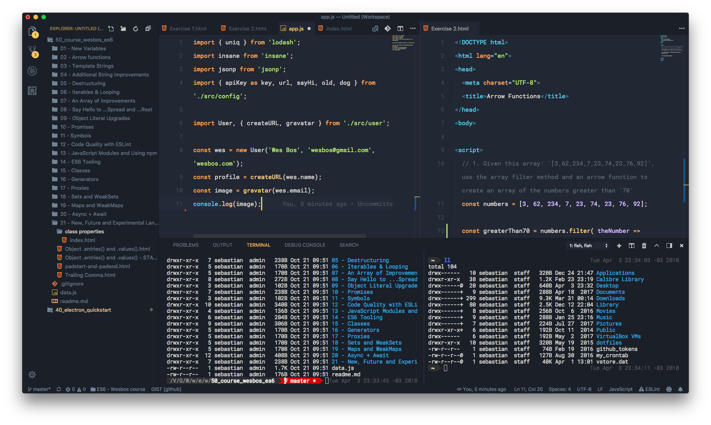

# Field Lights

### Screenshots

#### Main editor + Explorer, standard icon theme

#### Monochromatic folders icon theme and integrated terminal

### Description

*Field Lights* is a dark Visual Studio Theme inspired by the great Ayu (Mirage) theme but adding some personal taste customizations.

The most important differences regarding Ayu Mirage theme are:

- Editor (active tab) "virtually" floating over the window
- Most divisions removed
- Indent guides are a little bit darker
- Cleaner sidebar
- Some other minor customizations

### Credits

- Folders icon by Landan Lloyd from the Noun Project